## Daily tasks

### fixed tasks

- [ ] [英语口语练习](#英语口语)
- [ ] [半导体物理学习](#半导体物理/模电)
- [ ] [模拟电子学习](#半导体物理/模电)
- [ ] [verilog 编程（FPGA）](#verilog)

### fixable tasks

```mermaid
gantt 
title Daily routine 
dateFormat HH:mm
axisFormat %H:%M
section morning 
英语口语 : 09:00, 1h 
半导体物理学习 : 1h
模拟电子学习 : 1h
lunch time : milestone, m1, 12:00,2h
section afternoon 
verilog设计 :14:00 , 3h
dinner time : milestone, m2, 17:00,2h
section evening 
fixable tasks: 19:00,1h 
```

### 英语口语

- [ ] 练习熟练表达
- [ ] 总结地道表达
- [ ] 口音纠正
- [ ] 面试内容准备
- [ ] 专业词汇准备

### 半导体物理/模电

- [ ] 理解内容
- [ ] 记住记录重要原理
- [ ] 标记课本
- [ ] 温故知新

### verilog

- [ ] 编写基础程序  若干
- [ ] 去年面试题  若干
- [ ] blog记录
- [ ] 自己设计硬件电路
