## Reference

集成电路工程专业需要哪些方面的知识？

- https://www.zhihu.com/collection/692953676（书多）

- (https://www.zhihu.com/question/50998132/answer/123672184)（课多）

## Daily tasks

### fixed tasks

- [ ] [英语口语练习](#英语口语)
- [ ] [半导体物理学习](#半导体物理)
- [ ] [模拟电子学习](#模拟电子技术)
- [ ] [verilog 编程（FPGA）](#verilog)

### fixable tasks

```mermaid
gantt 
title Daily routine 
dateFormat HH:mm
axisFormat %H:%M
section morning 
英语口语 : 09:00, 1h 
半导体物理学习 : 1h
模拟电子学习 : 1h
lunch time : milestone, m1, 12:00,2h
section afternoon 
verilog设计 :14:00 , 3h
dinner time : milestone, m2, 17:00,2h
section evening 
fixable tasks: 19:00,1h 
```

### 英语口语

- [ ] 练习熟练表达
- [ ] 总结地道表达
- [ ] 口音纠正
- [ ] 面试内容准备
- [ ] 专业词汇准备

### 半导体物理/模电/数电

- 理解内容

- 记住记录重要原理

- 标记课本

- 温故知新

#### 半导体物理

##### 教程

1、cousera：https://www.coursera.org/learn/semiconductor-physics/home/welcome

#### 模拟电子技术

### verilog

- [ ] 编写基础程序  若干
- [ ] 去年面试题  若干
- [ ] blog记录
- [ ] 自己设计硬件电路

#### 教程

1. 菜鸟教程：https://www.runoob.com/w3cnote/verilog-tutorial.html
2. bilibili视频课： https://www.bilibili.com/video/BV1Dx411e7Af
3. 刷题网站：https://hdlbits.01xz.net/wiki/Step_one

#### 主要练习项目

1. FPGA板
2. 跟一本书或者视频课的练习（推荐）
3. 面试题（时间紧）
